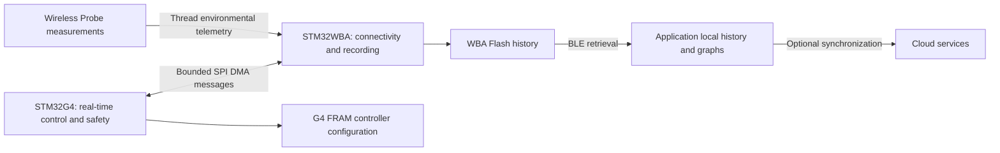

# Platform overview

The G4 remains responsible for local Lamp actuation and safety. WBA communication must not become a prerequisite for basic safety decisions. The communications controller can receive external intent, but the real-time controller validates its own operating limits.

The Lamp prototype uses distinct firmware images and a bounded 68-byte SPI transport. G4-originated operational snapshots and time references feed WBA recording; routine history is not written to a G4 FRAM telemetry ring.

G4 FRAM retains controller settings. The independent Lamp history interval uses an existing configuration field, while WBA maintains the live commit schedule. Probe routing recovery is reported in Phase 1B; the tested registry foundation remains a separate, unfinished integration and is not depicted as deployed authorization.

See [telemetry ownership](telemetry-and-data.md), [connectivity limitations](wireless-connectivity.md) and [status](../docs/development-status.md).
